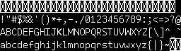
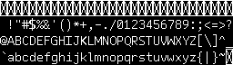

# Cury Font

* 

* 

The [fixed](Cury_TR12_fixed_v2.xcf) GIMP source `.xcf` has been provided.

# Glyphs fixed

* Off-by-one bug:
  * First 32 characters are now reserved (0x00 - 0x1F)
  * Space starts on first cell in the second row (0x20)
  * At symbol starts on first cell in the third row (0x40)
  * Back tick starts on first cell in the fourth row (0x60)

## Symbols

* Hash has both top and bottom horizontal lines flush
* Dollar sign `$` has slash straightened
* Dollar sign `$` height is now symmetrical top and bottom
* Dot in the comma `,` matches the period .
* Top bar on the 5 is one pixel longer to the right
* Dot in the semicolon `;` matches the the period `.`

## Uppercase

* The circle in at sign `@` is now symmetrical
* Bar in the uppercase `A` has been moved up
* The middle bar of the uppercase `E` is one pixel shorter on the right
* Bottom bar of the uppercase `F` is one pixel shorter on the right
* Bar on the uppercase `G` has been moved up to be flush with the x-height 
* Uppercase `N` is now symmetrical
* Uppercase `Q` tail bleed into the center has been removed
* Uppercase `Q` tail has been moved over to the right one pixel
* Uppercase `W` has been moved over to it doesn't bleed into the `X` cell
* Uppercase `X` is now centered horizontally within the character cell
* Uppercase `Z` is now centered horizontally
* Square brackets `[` and `]` are now centered both vertically and horizontally within the character cell
* Backslash \ is now centered horizontally
* Backslash \ is now extended by 2 pixels on the top left to match the brackets
* Caret `^` is now centered horizontally within the character cell
* Underscore `_` is now the full character cell width

## Lowercase

* Backtick `\` height now matches the single and double quote height
* Lowercase `c` matches tch the lowercase `d`
* Ends of the lowercase `c` match the uppercase `C`
* Horizontal bar on the lowercase `f` matches the x-height (lowercase height of the other letters)
* Serif on the lowercase `r` is now one pixel instead of two
* Fixed tail on the lowercase `y` to better match `j` and is now full width
* Tilde `~` moved up 

# Not fixed

* Inconsistent kerning with uppercase letters

# Reference

* https://www.reddit.com/r/gameassets/comments/f1fk79/cury_tr12_a_free_to_use_raster_font_designed_for/ 
